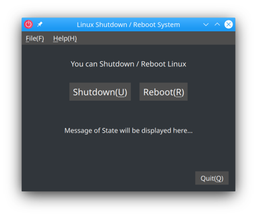
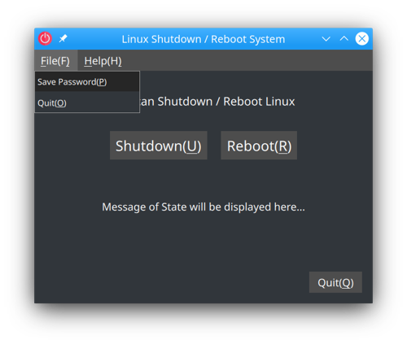
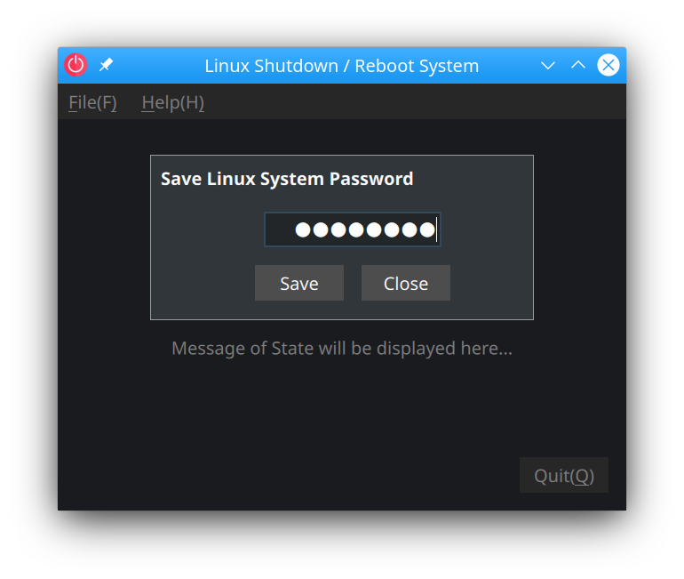

# PoweroffQML for x86 and x64  

# Preface  
PoweroffQML is a Linxu system shutdown / reboot software for Linux x86 /x64. 
It can easily shutdown/restart Linux systems just by pressing button. 
 
You can also change the shutdown sound by placing Shutdown.wav, 
in a directory on the same level as the executable binary. 
 
*Note:* 
*PoweroffQML is created in Qt 5.15, so it requires Qt 5.15 library.* 
 

# 1. Install the necessary dependencies for PineScaleQML
Create a directory for installing Qt libraries on PinePhone. 
* libQt5Core.so.5
* libQt5Gui.so.5
* libQt5Quick.so.5
* libQt5QuickControls2.so.5
* libQt5Qml.so.5
* libQt5QmlModels.so.5
* libQt5Network.so.5
* libQt5Multimedia.so.5
 

Get the latest updates. 

    # Debian / Ubuntu
    sudo apt update
    sudo apt upgrade

    # SUSE
    sudo zypper update
 

Install the dependencies required to build the PoweroffQML.  

    # Debian / Ubuntu
    sudo apt-get install qt5-qmake qt5-qmake-bin \
                         libqt5core5a libqt5gui5 libqt5quick5 libqt5quickcontrols2-5 \
                         libqt5qml5 libqt5qmlmodels5 libqt5network5 libQt5Multimedia5
    
    # SUSE
    sudo zypper install  libqt5-qtbase-common-devel libQt5Core5 libQt5Gui5 \
                         libqt5-qtquickcontrols libQt5QuickControls2-5 \
                         libqt5qmlmodels5 libQt5Network5 libQt5multimedia5
 
 

# 2. Compile PoweroffQML
Download the source code from PoweroffQML's Github. 

    git clone https://github.com/presire/PoweroffQML.git PoweroffQML
 

Use the qmake command to compile the source code of PoweroffQML. 
The default installation directory is <I>**${PWD}/PoweroffQML**</I>. 

The recommended installation directory is the home directory. (Ex. <I>**${HOME}/InstallSoftware/PoweroffQML**</I>)

    cd PoweroffQML

    mkdir build && cd build

    qmake ../PoweroffQML.pro PREFIX=<The directory you want to install in>
    make -j $(nproc)
    make install
 

Copy Shutdown.wav to a directory at the same level as the Poweroff QML executable binary. 

    cp Shutdown.wav /<Directory at the same level as the installed Poweroff QML>/
 

# 3. Create DesktoEntry for PoweroffQML
    vi ~/.local/share/applications/PoweroffQML.desktop
 

    [Desktop Entry]
    Type=Application
    Name=PoweroffQML
    GenericName=PoweroffQML
    Comment=Linux Shutdown / Reboot Software
    Icon=/<PoweroffQML Install Directory>/PoweroffQML.svg
    Exec=/<PoweroffQML Install Directory>/PoweroffQML %F
    Terminal=false
    Categories=Utility;
 

 
 

# 4. Execute PoweroffQML
Make sure you can execute **PoweroffQML**. 
 

 
 
First, select [File] -> [Save Password]. 
Next, enter the Linux administrator password and click the [Save] button. 

 
Press the [Shutdown] or [Reboot] button to see if Linux will shutdown/restart.  
(You can also use the shortcut key [U] Key to shut down and [R] Key to reboot.) 
 
 

